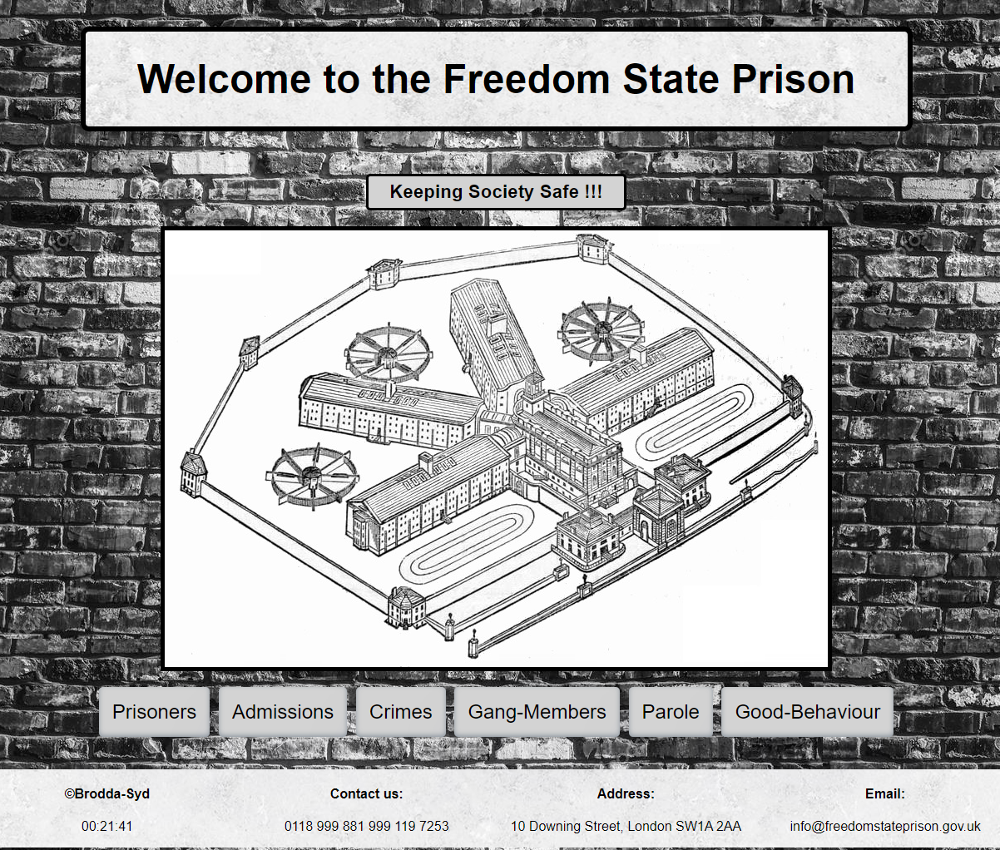

# Freedom State Prison
## About
This is my 2nd ever website that I built during my Boolean course. \
Since my first project was a "Gallery of Joy" built using HTML & CSS only! \
I decided to do something a bit more practicle and disheartening. \
A prison administration system hosted on Netlify.com that turned out to be quite amusing in the end. \
Built purely on JavaScript, CSS & JSON. \
Hosted at: https://infallible-minsky-edb916.netlify.app/

  

## How to build this app
mkdir boolean-uk-js-project \
cd boolean-uk-js-project \
git clone https://github.com/sydneymurray/boolean-uk-js-project.git 

## Start JSON Server
json-server --watch db/db.json  

## Features
You can admit, modify and discharge prisoner details 

